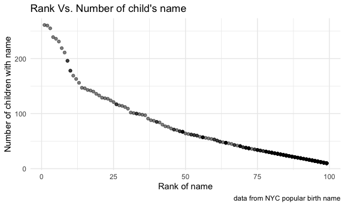

P8105_hw2_hc3212
================
Hening cui
2021/10/3

## Problem 1

Read and clean the Mr. Trash Wheel sheet.

``` r
trash_wheel_df = 
  read_excel("./data/Trashwheel.xlsx", sheet = "Mr. Trash Wheel", range = "A2:N408") %>% 
  janitor::clean_names() %>% 
  drop_na(dumpster) %>% 
  mutate(sports_balls = as.integer(sports_balls))
```

Read and clean precipitation data for 2018 and 2019.

``` r
pre_2018_df = 
  read_excel("./data/Trashwheel.xlsx", sheet = "2018 Precipitation", range = "A2:B15") %>%
  janitor::clean_names() %>% 
  drop_na(month, total) %>% 
  mutate(year = 2018) %>% 
  relocate(year) 

pre_2019_df = 
  read_excel("./data/Trashwheel.xlsx", sheet = "2019 Precipitation", range = "A2:B15") %>%
  janitor::clean_names() %>% 
  drop_na(month, total) %>% 
  mutate(year = 2019) %>%
  relocate(year) 
```

Precipitation combine.

``` r
NPre_df = 
  bind_rows(pre_2018_df, pre_2019_df) %>% 
  mutate(month = month.name[month])
```

The first data set was generated by Mr. Trashwheel trash collector in
Baltimore, Maryland which include the information of trash entering,
colletion and dumpster storage. The dataset contains information on
dumpster, month, year, date, weight_tons, volume_cubic_yards,
plastic_bottles, polystyrene, cigarette_butts, glass_bottles,
grocery_bags, chip_bags, sports_balls, homes_powered. There are a total
of 345 rows in our final dataset.

The second data set was the month precipitation data in 2018 and 2019.
The dataset contains information on year, month, total. There are a
total of 24 rows in our final dataset.

-   The total precipitation in 2018 was 70.33 inches.
-   The median number of sports balls found in a dumpster in 2019 was 9

## Problem 2

Read and clean pols-month.csv.

``` r
pols_month_df = 
  read_csv("./data/fivethirtyeight/pols-month.csv") %>% 
  janitor::clean_names() %>% 
  drop_na() %>% 
  separate(mon, into = c("year", "month", "day"), sep = "-") %>%
  mutate(
    year = as.integer(year),
    month = as.integer(month), 
    day = as.integer(day),
    month = month.name[month], 
    presidents = ifelse(prez_gop == 0, "dem", "gop")
  ) %>% 
  select( -day, -prez_gop, -prez_dem) %>% 
  relocate(year, month, presidents)
view(pols_month_df)
```

Read and clean snp.csv.

``` r
snp_df = 
  read_csv("./data/fivethirtyeight/snp.csv") %>% 
  janitor::clean_names() %>% 
  drop_na() %>% 
  mutate(date = mdy(as.character(date))) %>% 
  separate(date, into = c("year", "month", "day"), sep = "-") %>% 
  mutate(
    year = as.integer(year),
    year = ifelse(year > 2021, year - 100, year),
    month = as.integer(month), 
    day = as.integer(day),
    month = month.name[month]) %>% 
  select(-day) %>% 
  arrange(year, month) %>% 
  relocate(year, month)
view(snp_df) 
```

Read and clean unemployment.csv.

``` r
unemployment_df = 
  read_csv("./data/fivethirtyeight/unemployment.csv") %>% 
  janitor::clean_names() %>% 
  drop_na() 

unemployment_clean_df =
  pivot_longer(
    unemployment_df,
    jan:dec,
    names_to = "month",
    values_to = "percentage"
  ) 
view(unemployment_clean_df)
```

Join the datasets.

``` r
pols_tidy_df =
  pols_month_df %>% 
  mutate(month = paste(month, "01", sep = "-"),
         month = as.Date(month, format = "%B-%d"),
         month = month(month)
         ) %>% 
  unite(date,year,month,sep = "-")
view(pols_tidy_df) 

snp_tidy_df =
  snp_df %>% 
  mutate(month = paste(month, "15", sep = "-"),
         month = as.Date(month, format = "%B-%d"),
         month = month(month)
         ) %>% 
  unite(date,year,month,sep = "-")
view(snp_tidy_df) 

unemployment_tidy_df =
  unemployment_clean_df %>% 
  mutate(month = paste(month, "01", sep = "-"),
         month = as.Date(month, format = "%B-%d"),
         month = month(month)
         ) %>% 
  unite(date,year,month,sep = "-")
view(unemployment_tidy_df) 

pols_snp_df = 
  left_join(pols_tidy_df,snp_tidy_df,by = c("date" = "date")) 
view(pols_snp_df)

Fivethirtyeight_df =
  left_join(pols_snp_df,unemployment_tidy_df, by = c("date" = "date"))
view(Fivethirtyeight_df)
```

The pols-month dataset describes the political landscape information of
the US from 1947 to 2015. There are a total of 822 rows, and 8 columns
in our final dataset. The dataset contains information on date,
presidents, gov_gop, sen_gop, rep_gop, gov_dem, sen_dem, rep_dem.

The snp dataset shows the closing vales of the S&P stock index on the
associated month and year which from 1950 to 2015. There are a total of
787 rows, and 2 columns in our final dataset. The dataset contains
information on date, close.

The unemployment dataset presents the unemployment percentage of a
particular month from 1948 to 2014. There are a total of 804 rows, and 3
columns in our final dataset. The dataset contains information on year,
month, percentage.

The Fivethirtyeight dataset contains information on the political
landscape, stock performance, and unemployment percentages by merging
the previous 3 datasets together according to date. The time range from
1947 to 2015. There are a total of 822 rows, and 10 columns in our final
dataset. The dataset contains information on date, presidents, gov_gop,
sen_gop, rep_gop, gov_dem, sen_dem, rep_dem, close, percentage.

## Problem 3

Read and clean the NYC Popular_Birth_Name.csv.

``` r
NYC_birthname_df = 
  read_csv("./data/Popular_Baby_Names.csv") %>% 
  janitor::clean_names() %>%  
  drop_na() %>%
  mutate(childs_first_name = toupper(childs_first_name), 
         enthnicity =  gsub("BLACK NON HISP$", "BLACK NON HISPANIC", pull(.,ethnicity)),
         enthnicity = gsub("WHITE NON HISP$", "WHITE NON HISPANIC", pull(.,ethnicity)),
         enthnicity = gsub("ASIAN AND PACI$", "ASIAN AND PACIFIC ISLANDER", pull(.,ethnicity))) %>% 
  distinct()
view(NYC_birthname_df)
```

Build Olivial popularity table.

``` r
Olivial_df = 
  NYC_birthname_df %>% 
  filter(childs_first_name == "OLIVIA", gender == "FEMALE") %>% 
  select(-count) %>% 
  pivot_wider(
    names_from = year_of_birth,
    values_from = rank
  ) %>% 
  relocate(c(1:3),c(9:4)) %>% 
  knitr::kable()
Olivial_df
```

| gender | ethnicity                  | childs_first_name | 2012 | 2013 | 2014 | 2015 | 2016 | enthnicity                 | 2011 |
|:-------|:---------------------------|:------------------|-----:|-----:|-----:|-----:|-----:|:---------------------------|-----:|
| FEMALE | ASIAN AND PACIFIC ISLANDER | OLIVIA            |   NA |    3 |    1 |    1 |    1 | ASIAN AND PACIFIC ISLANDER |    4 |
| FEMALE | BLACK NON HISPANIC         | OLIVIA            |   NA |    6 |    8 |    4 |    8 | BLACK NON HISPANIC         |   10 |
| FEMALE | HISPANIC                   | OLIVIA            |   22 |   22 |   16 |   16 |   13 | HISPANIC                   |   18 |
| FEMALE | WHITE NON HISPANIC         | OLIVIA            |   NA |    1 |    1 |    1 |    1 | WHITE NON HISPANIC         |    2 |
| FEMALE | ASIAN AND PACI             | OLIVIA            |    3 |   NA |   NA |   NA |   NA | ASIAN AND PACIFIC ISLANDER |   NA |
| FEMALE | BLACK NON HISP             | OLIVIA            |    8 |   NA |   NA |   NA |   NA | BLACK NON HISP             |   NA |
| FEMALE | WHITE NON HISP             | OLIVIA            |    4 |   NA |   NA |   NA |   NA | WHITE NON HISP             |   NA |

Build the table of most popular name in male.

``` r
Male_popular_df = 
  NYC_birthname_df %>% 
  filter( gender == "MALE", rank == "1") %>% 
  select(-count) %>% 
  pivot_wider(
    names_from = "year_of_birth",
    values_from = "childs_first_name"
  ) %>% 
  relocate(1, 2, c(8:3)) %>% 
  knitr::kable()
Male_popular_df
```

| gender | ethnicity                  | 2013   | 2014   | 2015   | 2016   | enthnicity                 | rank | 2012   | 2011    |
|:-------|:---------------------------|:-------|:-------|:-------|:-------|:---------------------------|-----:|:-------|:--------|
| MALE   | ASIAN AND PACIFIC ISLANDER | JAYDEN | JAYDEN | JAYDEN | ETHAN  | ASIAN AND PACIFIC ISLANDER |    1 | NA     | ETHAN   |
| MALE   | BLACK NON HISPANIC         | ETHAN  | ETHAN  | NOAH   | NOAH   | BLACK NON HISPANIC         |    1 | NA     | JAYDEN  |
| MALE   | HISPANIC                   | JAYDEN | LIAM   | LIAM   | LIAM   | HISPANIC                   |    1 | JAYDEN | JAYDEN  |
| MALE   | WHITE NON HISPANIC         | DAVID  | JOSEPH | DAVID  | JOSEPH | WHITE NON HISPANIC         |    1 | NA     | MICHAEL |
| MALE   | ASIAN AND PACI             | NA     | NA     | NA     | NA     | ASIAN AND PACIFIC ISLANDER |    1 | RYAN   | NA      |
| MALE   | BLACK NON HISP             | NA     | NA     | NA     | NA     | BLACK NON HISP             |    1 | JAYDEN | NA      |
| MALE   | WHITE NON HISP             | NA     | NA     | NA     | NA     | WHITE NON HISP             |    1 | JOSEPH | NA      |

Generate the plot of the number of children with a name vs the rank in
popularity of that name in male, white non-hispanic children born in
2016.


